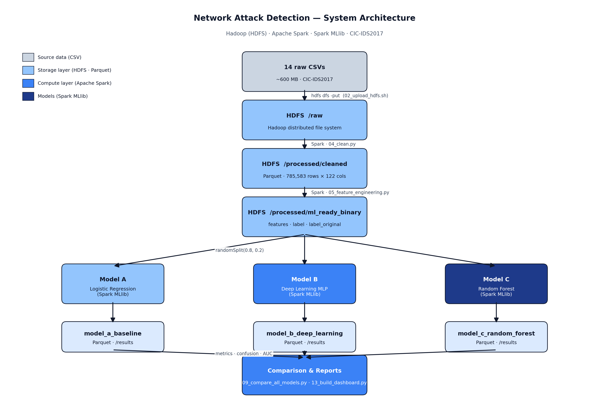
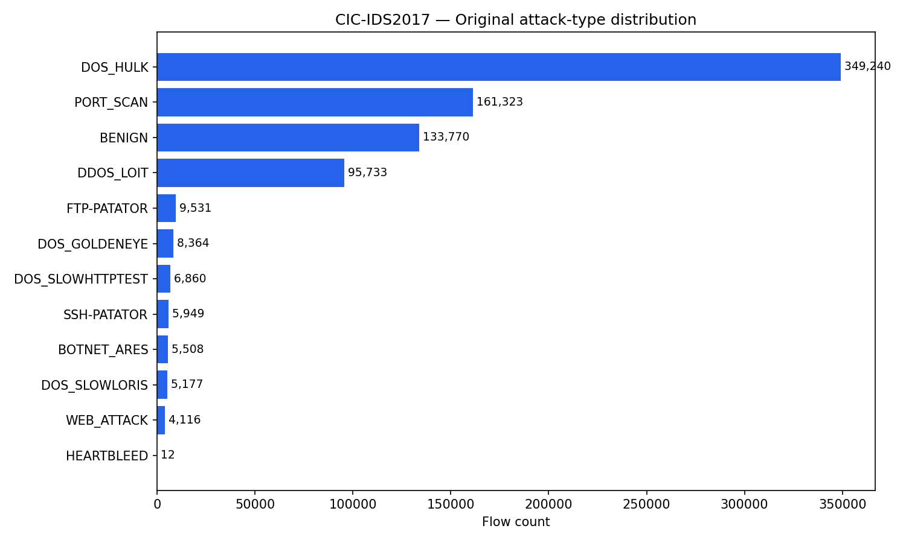
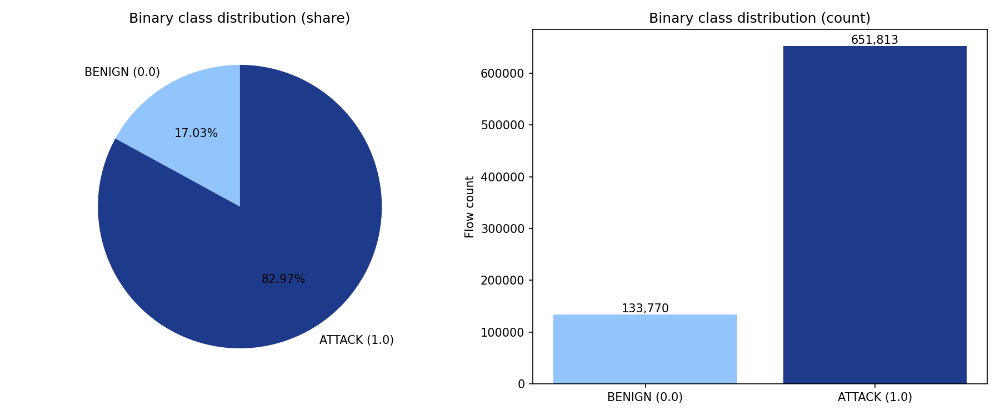
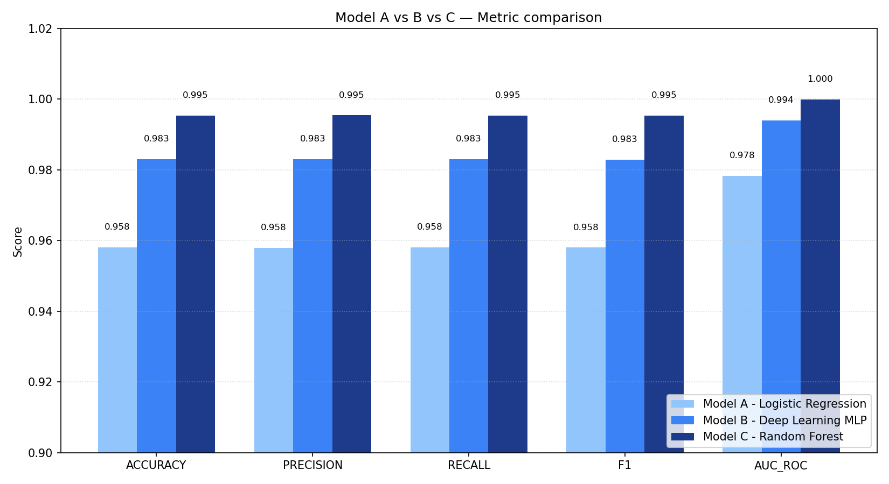
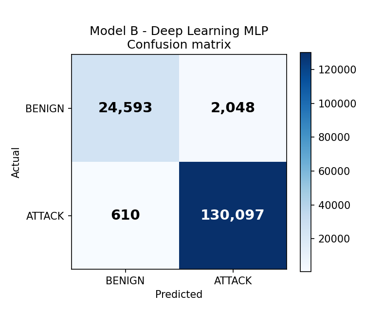
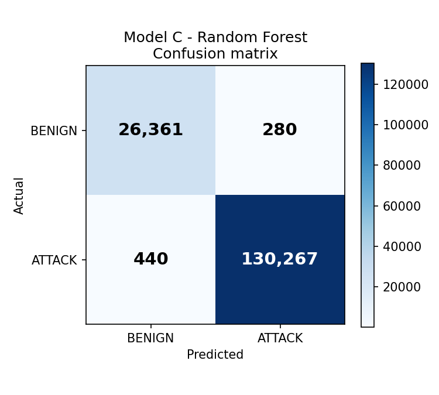
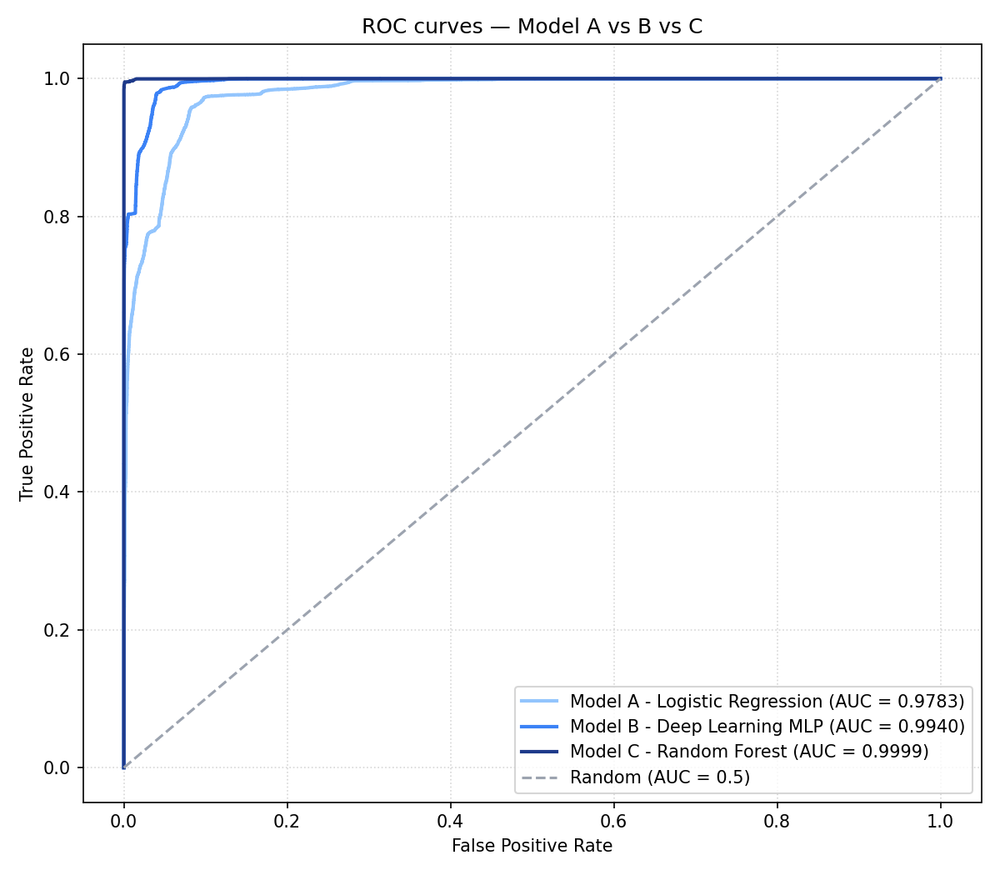
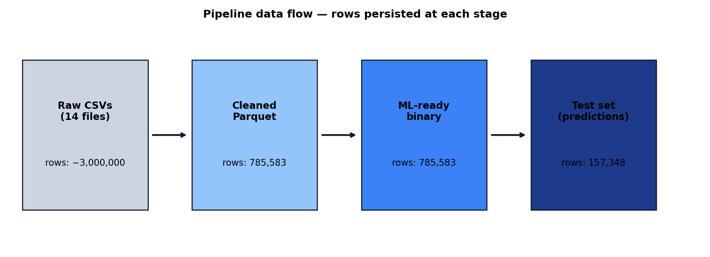

# Network Attack Detection — Big Data Pipeline


An end-to-end distributed machine learning pipeline for network intrusion detection, built on **Apache Spark** and **Hadoop HDFS**. Three models — Logistic Regression, Deep Learning MLP, and Random Forest — are trained and compared on the **CIC-IDS2017** dataset, achieving up to **99.54% accuracy** and **AUC-ROC of 0.9999** with Random Forest.

---

## Table of Contents

- [Overview](#overview)
- [System Architecture](#system-architecture)
- [Features](#features)
- [Technologies Used](#technologies-used)
- [Dataset](#dataset)
- [Folder Structure](#folder-structure)
- [Installation](#installation)
- [Running the Pipeline](#running-the-pipeline)
- [Local Reports & Interactive Dashboard](#local-reports--interactive-dashboard)
- [Results](#results)
- [Performance Metrics](#performance-metrics)
- [Future Improvements](#future-improvements)
- [License](#license)

---

## Overview

Network intrusion detection is a critical problem in cybersecurity. Traditional rule-based systems struggle to adapt to evolving attack patterns. This project implements a **scalable big data pipeline** that:

- Ingests and cleans 14 raw CSV files (785,583 network flow records, 122 features) from the CIC-IDS2017 dataset
- Engineers domain-specific features and prepares a binary classification target (BENIGN vs. ATTACK)
- Trains and evaluates three machine learning models using **Spark MLlib** on a distributed Hadoop/Spark cluster
- Generates professional visualizations, an interactive Streamlit dashboard, and a standalone HTML report

The pipeline is **fully automated** and **idempotent** — it safely re-runs without retraining completed stages.

---

## System Architecture

```
14 raw CSVs (600 MB)
      │
      ▼  scripts/02_upload_hdfs.sh
HDFS  /user/bigdata/ids2017/raw
      │
      ▼  04_clean.py  [Spark]
HDFS  /processed/cleaned          ← 785,583 rows × 122 columns
      │
      ▼  05_feature_engineering.py  [Spark]
HDFS  /processed/ml_ready_binary  ← features vector · label · label_original
      │
      ├──────────────┬──────────────┐
      ▼              ▼              ▼
06_baseline    07_improved    08_random_forest
(Logistic Reg) (MLP 3-layer)  (RF 80 trees)
 [Spark MLlib]  [Spark MLlib]  [Spark MLlib]
      │              │              │
      ▼              ▼              ▼
HDFS /results/model_a  /results/model_b  /results/model_c
      └──────────────┬──────────────┘
                     ▼  09_compare_all_models.py
             /results/model_comparison_all
             + reports/model_comparison_report.html
                     │
                     ▼  scripts/reporting/
             reports/figures/*.png
             reports/dashboard.html
             reports/architecture.png
```



---

## Features

- **Distributed ETL** — Ingests and cleans 600 MB of network flow data across 14 CSV files using PySpark
- **Robust Cleaning** — Strips Infinity values, filters impossible negatives, standardizes 12 attack labels
- **Feature Engineering** — Derives 7 domain-specific network flow features; outlier capping at 1st/99th percentile
- **Three ML Models** — Logistic Regression (baseline), Deep Learning MLP, and Random Forest
- **Automated Comparison** — Side-by-side accuracy, precision, recall, F1, and AUC-ROC evaluation
- **Idempotent Pipeline** — Skips completed stages via HDFS `_SUCCESS` markers; safe to re-run
- **Interactive Dashboard** — Streamlit app with live ROC curves, confusion matrices, and metric charts
- **Standalone HTML Report** — Self-contained dashboard embeds all charts as base64 (no external files)
- **Cross-platform Scripts** — Both Bash (`.sh`) and PowerShell (`.ps1`) launchers for every stage

---

## Technologies Used

| Category | Technology |
|---|---|
| Language | Python 3.8+ |
| Distributed Computing | Apache Spark 3.3, PySpark |
| Storage | Apache Hadoop HDFS |
| Machine Learning | Spark MLlib (Logistic Regression, MLP, Random Forest) |
| Data Format | Apache Parquet (Snappy compression) |
| Containerization | Docker Compose |
| Visualization | Matplotlib, Streamlit |
| Data Processing | Pandas, NumPy, PyArrow |
| Evaluation | scikit-learn (ROC/AUC) |
| Notebooks | Jupyter |

---

## Dataset

**CIC-IDS2017** — Canadian Institute for Cybersecurity Intrusion Detection System 2017

| Property | Value |
|---|---|
| Raw size | ~600 MB (14 CSV files) |
| Total records | 785,583 network flows |
| Features | 122 numeric columns |
| Classes (original) | 12 (11 attack types + BENIGN) |
| Classification task | Binary: BENIGN (0) vs. ATTACK (1) |

**Label distribution after cleaning:**

| Attack Type | Count |
|---|---:|
| DOS_HULK | 349,240 |
| PORT_SCAN | 161,323 |
| BENIGN | 133,770 |
| DDOS_LOIT | 95,733 |
| FTP-PATATOR | 9,531 |
| DOS_GOLDENEYE | 8,364 |
| DOS_SLOWHTTPTEST | 6,860 |
| SSH-PATATOR | 5,949 |
| BOTNET_ARES | 5,508 |
| DOS_SLOWLORIS | 5,177 |
| WEB_ATTACK | 4,116 |
| HEARTBLEED | 12 |

> `WEB_ATTACK` consolidates Web Brute Force, XSS, and SQL Injection into a single class.

The raw CSVs are excluded from git (`.gitignore`). Place all 14 CSV files in `data/raw/CSVs/` before running the pipeline.

---

## Folder Structure

```
network-attack-detection/
│
├── dashboard/
│   └── app.py                        ← Streamlit interactive dashboard
│
├── deliverables/
│   ├── paper/                        ← Final paper (place PDF here)
│   └── presentation/
│       └── final presentation.pptx   ← Slide deck
│
├── notebook/
│   ├── 04_cleaning.ipynb             ← EDA and cleaning walkthrough
│   └── 05_feature_engineering.ipynb  ← Feature engineering walkthrough
│
├── outputs/
│   ├── hdfs_export/                  ← Local mirror of HDFS Parquet outputs
│   │   ├── processed/cleaned/
│   │   ├── processed/ml_ready_binary/
│   │   └── results/                  ← model_a, model_b, model_c, model_comparison_all
│   └── readable_exports/             ← Human-readable CSV/HTML samples
│
├── reports/
│   ├── figures/                      ← 8 publication-quality PNG charts
│   ├── metrics/                      ← confusion_matrices.json, roc_auc.json
│   ├── tables/                       ← Attack distribution & metric CSVs
│   ├── architecture.png              ← System architecture diagram
│   ├── dashboard.html                ← Standalone HTML dashboard (661 KB)
│   ├── model_comparison_report.html  ← HTML model comparison report
│   └── Section4_System_Architecture.docx
│
├── scripts/
│   ├── pipeline/                     ← Core Spark jobs (submitted to cluster)
│   │   ├── 04_clean.py               ← Data ingestion and cleaning
│   │   ├── 05_feature_engineering.py ← Feature engineering and ML preparation
│   │   ├── 06_model_baseline.py      ← Logistic Regression
│   │   ├── 07_model_improved.py      ← Deep Learning MLP
│   │   ├── 08_model_random_forest.py ← Random Forest
│   │   └── 09_compare_all_models.py  ← Model comparison and HTML report
│   │
│   ├── reporting/                    ← Local visualization scripts (no cluster needed)
│   │   ├── 13_build_dashboard.py     ← Generate 8 PNG figures
│   │   ├── 14_build_html_dashboard.py← Build self-contained HTML dashboard
│   │   ├── 15_build_architecture_diagram.py
│   │   └── run_dashboard_only.py     ← Re-run all reporting in one command
│   │
│   ├── 02_upload_hdfs.sh / .ps1      ← Upload CSVs to HDFS
│   ├── 03_submit.sh / .ps1           ← Submit cleaning job
│   ├── 05_submit_features.sh / .ps1  ← Submit feature engineering job
│   ├── 06_submit_baseline.ps1        ← Submit Logistic Regression job
│   ├── 07_submit_improved.sh / .ps1  ← Submit Deep Learning MLP job
│   ├── 08_submit_random_forest.sh / .ps1 ← Submit Random Forest job
│   ├── 09_submit_compare_all.sh / .ps1   ← Submit model comparison job
│   └── 10_export_readable_outputs.py ← Export HDFS Parquet to local CSV
│
├── data/
│   └── raw/CSVs/                     ← 14 CSV files go here (gitignored, ~600 MB)
│
├── run_pipeline.sh                   ← Master orchestrator (full end-to-end run)
├── verify_pipeline.sh                ← Verify pipeline completion status
├── requirements.txt                  ← Python dependencies (local reporting)
├── .gitignore
└── LICENSE
```

---

## Installation

### Prerequisites

- [Docker Desktop](https://docs.docker.com/desktop/) (running)
- Python 3.8+
- The `docker-hadoop-spark-jupyter` cluster folder
- The 14 CIC-IDS2017 CSV files (~600 MB total)

### 1. Clone the repository

```bash
git clone https://github.com/zakariahmedd34/network-attack-detection.git
cd network-attack-detection
```

### 2. Install local Python dependencies

```bash
pip install -r requirements.txt
```

### 3. Place the dataset CSVs

```
network-attack-detection/
└── data/
    └── raw/
        └── CSVs/        ← all 14 .csv files here
```

### 4. Start the Hadoop/Spark cluster

```bash
# from the docker-hadoop-spark-jupyter folder:
docker compose up -d

# verify all services are running:
docker ps
# Expected: namenode, datanode, spark-master, spark-worker-1, jupyter
```

---

## Running the Pipeline

### One-command full run

```bash
bash run_pipeline.sh
```

This executes every stage in order. Stages with an existing HDFS `_SUCCESS` marker are automatically skipped, making it safe to re-run at any point.

### Manual stage-by-stage execution

| Stage | Mac/Linux | Windows |
|---|---|---|
| Upload CSVs to HDFS | `bash scripts/02_upload_hdfs.sh` | `.\scripts\02_upload_hdfs.ps1` |
| Data cleaning | `bash scripts/03_submit.sh` | `.\scripts\03_submit.ps1` |
| Feature engineering | `bash scripts/05_submit_features.sh` | `.\scripts\05_submit_features.ps1` |
| Logistic Regression | *(see run_pipeline.sh fallback)* | `.\scripts\06_submit_baseline.ps1` |
| Deep Learning MLP | `bash scripts/07_submit_improved.sh` | `.\scripts\07_submit_improved.ps1` |
| Random Forest | `bash scripts/08_submit_random_forest.sh` | `.\scripts\08_submit_random_forest.ps1` |
| Model comparison | `bash scripts/09_submit_compare_all.sh` | `.\scripts\09_submit_compare_all.ps1` |
| Export to local CSV | `python3 scripts/10_export_readable_outputs.py` | `python scripts/10_export_readable_outputs.py` |

### Verify completion

```bash
bash verify_pipeline.sh
```

### Useful cluster URLs (while running)

| Service | URL |
|---|---|
| Jupyter | http://localhost:8888 |
| HDFS Browser | http://localhost:9870 |
| Spark UI | http://localhost:8080 |

### Notebooks (optional walkthroughs)

Copy a notebook into the Jupyter container's notebooks folder, then open http://localhost:8888:

```bash
# Mac/Linux
cp notebook/04_cleaning.ipynb ~/path/to/docker-hadoop-spark-jupyter/notebooks/
cp notebook/05_feature_engineering.ipynb ~/path/to/docker-hadoop-spark-jupyter/notebooks/

# Windows PowerShell
Copy-Item ".\notebook\04_cleaning.ipynb" "C:\path\to\docker-hadoop-spark-jupyter\notebooks\"
```

---

## Local Reports & Interactive Dashboard

All visualizations can be regenerated without the cluster, using the committed Parquet outputs in `outputs/hdfs_export/`.

### Regenerate all figures and HTML reports

```bash
python scripts/reporting/run_dashboard_only.py
```

This produces:
- `reports/figures/*.png` — 8 publication-quality charts
- `reports/dashboard.html` — self-contained HTML dashboard
- `reports/architecture.png` — system architecture diagram

### Launch the interactive Streamlit dashboard

```bash
streamlit run dashboard/app.py
```

The dashboard provides:
- Live KPI cards (best model, best F1, AUC)
- Attack-type distribution charts
- Interactive model comparison bar chart
- Side-by-side confusion matrices
- Overlaid ROC curves for all three models

---

## Results

### Attack Type Distribution



*Horizontal bar chart of all 12 attack classes. DOS_HULK dominates at 349,240 flows, while HEARTBLEED has only 12 — highlighting the severe class imbalance present in real-world intrusion data.*

### Binary Class Split (BENIGN vs. ATTACK)



*BENIGN flows account for 17% of the dataset (133,770 rows) versus ATTACK at 83% (651,813 rows). All three models handle this 5:1 imbalance well, achieving high precision and recall simultaneously.*

### Model Metric Comparison



*Grouped bar chart comparing accuracy, precision, recall, F1-score, and AUC-ROC across all three models. Random Forest achieves near-perfect scores on every metric.*

### Confusion Matrices

| Logistic Regression | Deep Learning MLP | Random Forest |
|---|---|---|
|  |  |  |

*Each heatmap shows true vs. predicted labels on the 157,117-row test set. Random Forest achieves the fewest misclassifications.*

### ROC Curves



*All three models achieve strong AUC scores. Random Forest reaches AUC = 0.9999, indicating near-perfect discrimination between benign and attack flows.*

### Pipeline Data Flow



*Data volume at each pipeline stage: from 14 raw CSVs through cleaning, feature engineering, three model training runs, and final comparison.*

---

## Performance Metrics

All models are evaluated on the **same held-out test set** (80/20 split, seed=42, ~157,117 rows).

| Model | Accuracy | Precision | Recall | F1 Score | AUC-ROC |
|---|---|---|---|---|---|
| Logistic Regression | 0.9581 | 0.9579 | 0.9581 | 0.9580 | 0.9783 |
| Deep Learning MLP | 0.9831 | 0.9830 | 0.9831 | 0.9829 | 0.9940 |
| **Random Forest** | **0.9954** | **0.9954** | **0.9954** | **0.9954** | **0.9999** |

**Random Forest** outperforms the baseline by **+3.73 pp** in F1 and achieves near-perfect AUC (0.9999 vs. 0.9783).

### Model Configuration

| Parameter | Logistic Regression | Deep Learning MLP | Random Forest |
|---|---|---|---|
| Algorithm | Logistic Regression | MultilayerPerceptronClassifier | RandomForestClassifier |
| Key settings | maxIter=10 | 3 layers, maxIter=80, blockSize=256 | numTrees=80, maxDepth=12, impurity=gini |
| Scaling | None | StandardScaler | None |
| Training rows | ~628,466 | ~628,466 | ~628,466 |
| Test rows | ~157,117 | ~157,117 | ~157,117 |

---

## Common Issues

**`ModuleNotFoundError: No module named 'numpy'` in Spark containers**

```bash
docker exec spark-master   bash -lc "apk add --no-cache py3-numpy"
docker exec spark-worker-1 bash -lc "apk add --no-cache py3-numpy"
```

**Permission denied on `.sh` scripts (Mac/Linux)**

```bash
chmod +x scripts/*.sh
```

**HDFS has stale data from a previous run**

```bash
docker exec namenode hdfs dfs -rm -r /user/bigdata/ids2017
bash scripts/02_upload_hdfs.sh
```

**Jupyter token not showing**

```bash
# Mac/Linux
docker logs jupyter 2>&1 | grep "token="

# Windows PowerShell
docker logs jupyter 2>&1 | Select-String "token="
```

**A pipeline stage cannot find its upstream input**

Check that the upstream stage completed successfully:
```bash
docker exec namenode hdfs dfs -ls -h /user/bigdata/ids2017/processed/cleaned
docker exec namenode hdfs dfs -ls -h /user/bigdata/ids2017/processed/ml_ready_binary
```

If the output is missing, re-run `bash run_pipeline.sh` — it will execute only incomplete stages.

---

## Future Improvements

- **Multi-class classification** — extend models to predict individual attack types instead of binary BENIGN/ATTACK, using `label_original`
- **Class imbalance handling** — apply SMOTE or class-weighted training to improve detection of rare attacks (e.g., HEARTBLEED with only 12 samples)
- **Hyperparameter tuning** — integrate Spark MLlib's `CrossValidator` or `TrainValidationSplit` for automated search
- **Streaming detection** — replace batch ingestion with Spark Structured Streaming on a Kafka source for real-time inference
- **Feature importance** — extract and visualize Random Forest feature importances to identify the most discriminative network flow statistics
- **Model persistence** — save trained models to HDFS with `model.save()` for production serving
- **Automated CI/CD** — add GitHub Actions to validate that reporting scripts produce consistent outputs on every push

---

## License

This project is licensed under the [MIT License](LICENSE).
